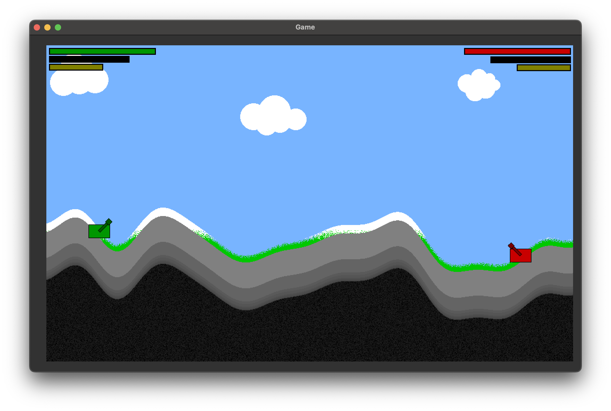

# README - Python Game

## Game Overview
The game is a simple 2D action game where two players compete against each other. Each player controls a character that can perform various actions, including movement and shooting. The goal of the game is to defeat the opponent through precise aiming and shooting.

## Screenshot

## Features

### 1. Player Control
- **Two Players:** The game supports two players, who can either play locally (PvP) or against an AI (PvE).
- **Movement:** Players can move their characters left and right to strategically position themselves.
- **Aiming and Shooting:** Players can aim at different angles and fire shots to hit the opponent.

### 2. AI Opponent
- **Intelligent AI:** The AI is programmed to monitor the player’s position and respond strategically. It can move and shoot to challenge the human player.

### 3. Graphical User Interface
- **Simple User Interface:** The user interface is intuitively designed, allowing for a quick entry into the game.
- **Power and Fuel Bars:** Players have power and fuel indicators that display the current status and energy of their characters.
- **Health Bar:** Each player has a health bar that shows their current health status. If health reaches zero, the game ends, and the winner is displayed.

### 4. Particle Effects
- **Visual Effects:** The game includes particle effects that are generated during specific actions (e.g., shots) to enhance the gaming experience.

### 5. Multiplayer Options
- **PvP Mode:** Players can compete directly against each other to test their skills.
- **PvE Mode:** Players can play against the AI and attempt to defeat it.

### 6. Endgame and Notifications
- **Game Over:** At the end of the game, a message is displayed to announce the winner.
- **Simple Restart Option:** Players can easily restart after the game ends to play another round.